# Merhaba, Ben Yusuf Ziya Elçi! 👋

**Elektrik-Elektronik Mühendisi | Otonom Sistemler Uzmanı | Proje Geliştirici**

---

## 🛠 Hakkımda

Merhaba, ben Yusuf Ziya Elçi. On yıldan fazla süredir elektrik-elektronik mühendisliği ve robotik sistemler üzerine çalışıyorum. Otonom kara ve su araçları geliştirme konusunda uzmanlaştım ve bu süreçte hem yazılım, hem donanım, hem de mekanik entegrasyon süreçlerini baştan sona yürütmekteyim. Projelerimle, ODTÜ Uluslararası Robot Yarışması ve TEKNOFEST gibi önemli yarışmalarda dereceler kazandım.

Mühendislik kariyerimin yanında matematik öğretmenliği geçmişimle eğitim alanında da uzun yıllar boyunca katkı sağladım. Elektrik-elektronik mühendisliği alanında edindiğim bilgi birikimiyle, otonom sistemler, denge mekanizmaları ve inovasyon üzerine yenilikçi çözümler geliştirmeyi hedefliyorum.

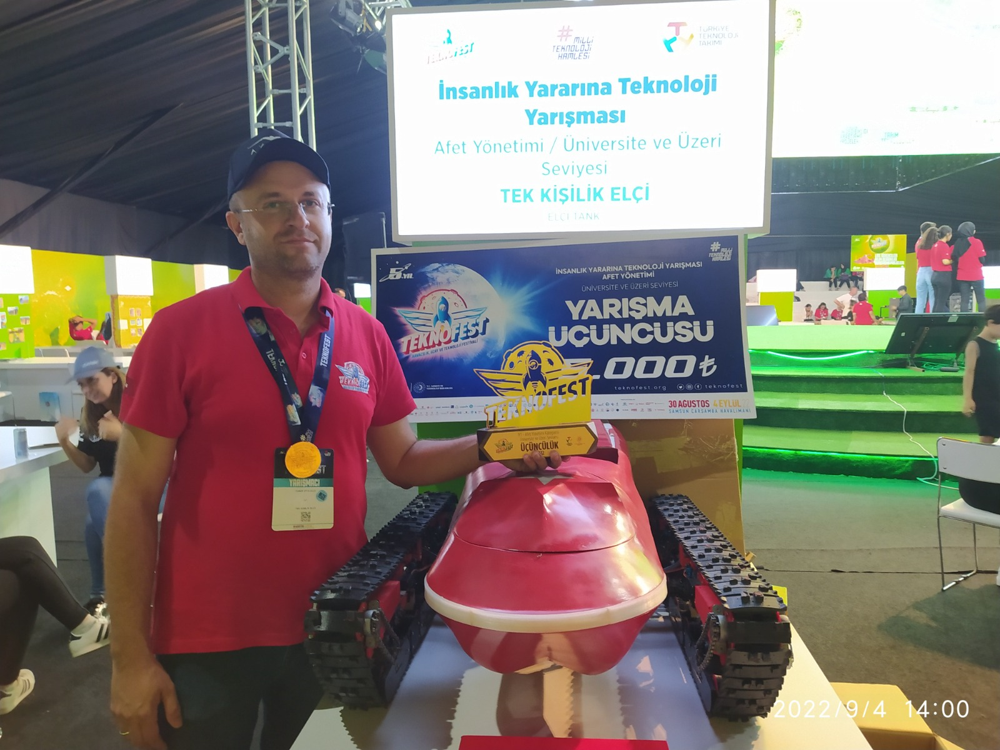

---

## 🚀 Uzmanlık Alanlarım

- **Otonom Kara ve Su Araçları**

- **PID Kontrol Algoritmaları**

- **Elektrik-Elektronik Tasarım ve Entegrasyon**

- **Mekanik Tasarım (SolidWorks, AutoCAD)**

- **Robotik Sistemler**

---

## 🏆 Yarışmalar ve Proje Başarılarım

- **2022:** TEKNOFEST, İnsanlık Yararına Teknoloji Yarışması - **3.lük Derecesi**

- **2021:** TEKNOFEST, İnsanlık Yararına Teknoloji Yarışması - **1.lik Derecesi**  
  [KSÜ Teknofest'ten Birincilikle Döndü](https://www.sabah.com.tr/egitim/ksu-teknofesten-birincilikle-dondu-5689707)

- **2019:** ODTÜ 16. Uluslararası Robot Yarışması, Robotden Projesi - **İnovasyon Kategorisi 1.lik**  
  [ODTÜ'de Birincilik İçin Yarıştık](https://anayurtgazetesi.com/haber/10507714/robotlar-odtude-birincilik-icin-yaristi)

- **2016:** Kahramanmaraş ARGE Proje Pazarı - **2.lik ve 3.lük Derecesi**

---

## 🌱 Projelerim

### **Balance Robot Car**

Üç tekerlekli otonom dengeli bir araç. PID kontrol algoritması kullanılarak, hız artışı ile birlikte tepki süresi hızlandırılmıştır. X ve Y eksenlerinde denge sağlayan bu araç, gözlemlenebilir yönü üzerinde bir platforma sahiptir. Daha fazla bilgi için [bu video bağlantısına](https://www.youtube.com/watch?v=EQujuVRfWSk&t=101s) göz atabilirsiniz.

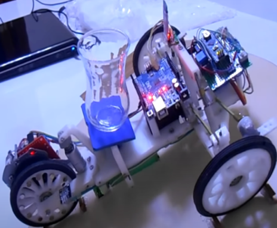

### **Balance Robot Car 2**

Dört tekerlekli ve arazi koşullarına uygun bir otonom dengeleme aracı. Hızlanma veya yavaşlama esnasında servo motorlar ve yaylar sayesinde dengeyi korur ve enerji tüketimini optimize eder. Hem X hem de Y eksenlerinde denge sağlamaktadır. Video için [bu bağlantıyı](https://www.youtube.com/watch?v=XnsT_rFEBeE) ziyaret edebilirsiniz.

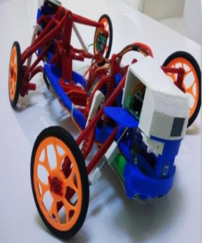

### **Balance Vehicle 4x4**

Scooter tipi bir araç olarak geliştirilmiş ve dengesizlik sorunlarını çözmeye odaklanmış otonom bir taşıt. Ergonomik yapısı ve enerji tüketimi avantajıyla öne çıkar. Bu araç, dengesizlikleri ve süspansiyon gereksinimlerini dengeleyebilecek kapasiteye sahiptir.

https://www.linkedin.com/feed/update/urn:li:activity:7127381573473058816/ 

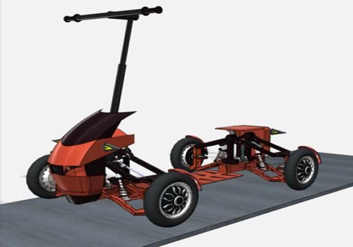

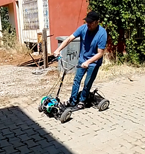

### **Elçi Tank V1**

Arazi koşullarına uygun bir paletli araç. Zemin temasını mekanik ve yazılımla maksimum düzeyde kavrar. Paletler, zeminin şeklini süspansiyon sistemi ile alır ve ağırlık dengesi otonom olarak eşit şekilde dağıtılır. Tek taraflı engel aşma yeteneği ile ağırlığını palet üzerinde daha verimli bir şekilde aktarır.

[Balance Robot CAR 2 (PROMOTION) - YouTube](https://www.youtube.com/watch?v=fKxtTBhjkz4&ab_channel=YUSUFZ%C4%B0YAEL%C3%87%C4%B0%28HayalEt%29)

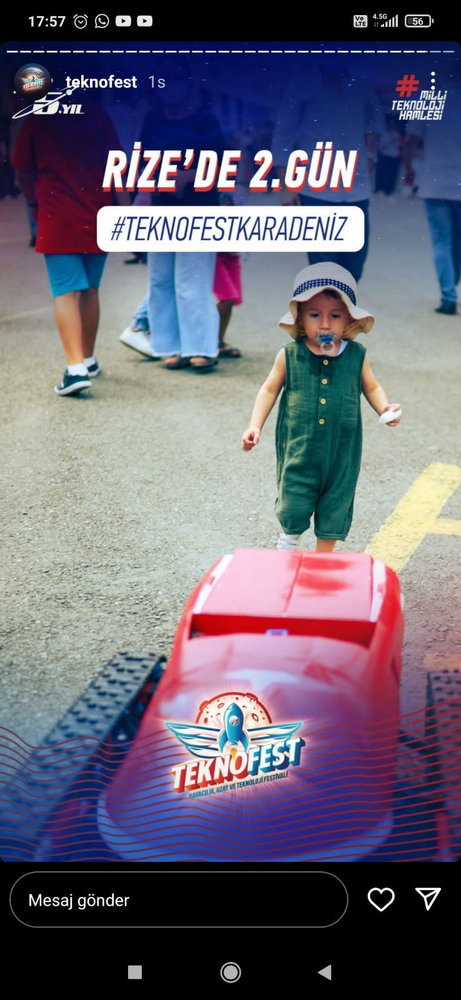

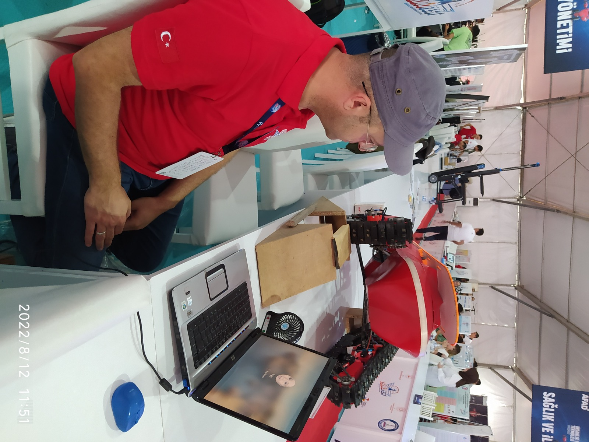

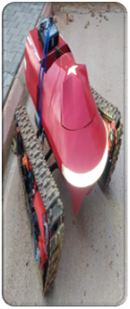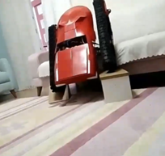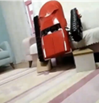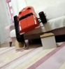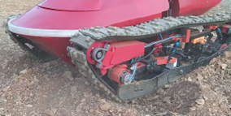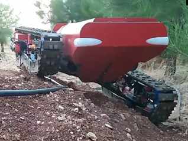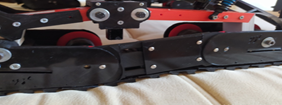

### **OtoFilika**

Arama-kurtarma görevleri için tasarlanmış bir otonom su aracı. Dalgalı deniz koşullarında dengesini koruyarak kazazedeleri güvenle kurtarma amacı taşır. Alabora olsa bile kendini otomatik olarak düzeltebilme yeteneğine sahiptir. Yüksek verimlilikte kurtarma operasyonları gerçekleştirmek amacıyla geliştirilmiştir.

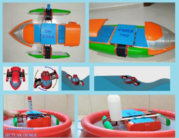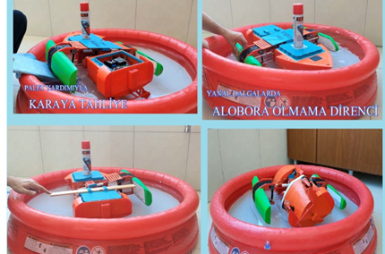

---

## ✨ Hedeflerim

Gelecekte otonom sistemlerde denge mekanizmalarını daha ileri seviyelere taşımayı, karmaşık PID kontrol algoritmaları kullanarak hassasiyeti artırmayı ve çevre dostu, alternatif enerji kaynaklarıyla çalışan araçlar geliştirmeyi hedefliyorum.

---

## 📫 Bana Ulaşın

- **E-posta:** yusufziyaelci@hotmail.com

- **LinkedIn:** [Yusuf Ziya Elçi](https://www.linkedin.com/feed/update/urn:li:activity:7127381573473058816/)

Her türlü iş birliği ve proje fikirleri için iletişime geçmekten çekinmeyin!

---

Teşekkürler ve profilimi ziyaret ettiğiniz için çok mutluyum! 🤝🚀
